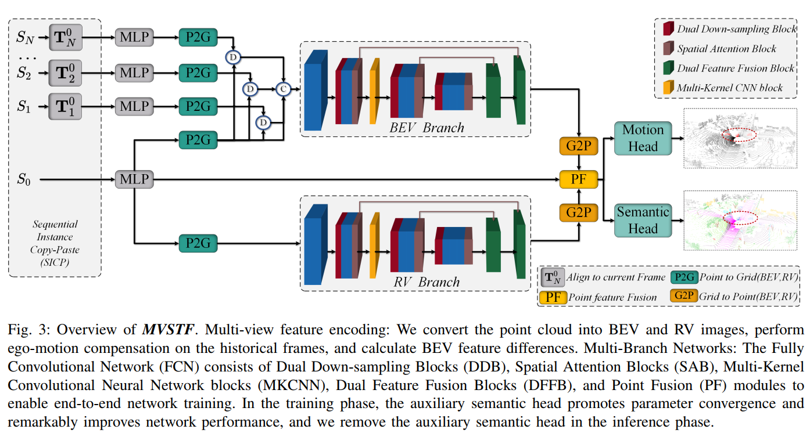

### MVSTF: Multi-View Spatio-Temporal Fusion for LiDAR-Based Moving Object Segmentation

#### Overview

MVSTF utilizes sequential point clouds to generate multi-view images and feature differences, and designs  multi-branch network to extract spatio-temporal and dimensional features in parallel, and realizes high-precision moving object segmentation. 



​                                 

#### 1 Environment Setup

This code is tested on Ubuntu 20.04 with Python 3.8, CUDA 11.1 and Pytorch 1.10.0.

```
conda create -n mvstf python=3.8 -y
conda activate mvstf

pip3 install torch==1.10.0+cu111 torchvision==0.11.1+cu111 torchaudio==0.10.0  -f https://download.pytorch.org/whl/torch_stable.html

CUDA>=10.1
Pytorch>=1.5.1
PyYAML@5.4.1
scipy@1.3.1

git clone https://github.com/ZhouJJ111/MVSTF.git

cd deep_point
python setup.py install
cd ../../

pip install -r requirements.txt


ln -s ~/anaconda3/envs/mvstf/lib/python3.6/site-packages/torch/distributed  MVSTF(yourproject)/
```

#### 2 Prepare Data

##### SemanticKITTI

Download SemanticKITTI dataset [here](http://www.semantic-kitti.org/dataset.html#overview). Extract everything into the same folder. Data file structure should look like this:

```
path_to_KITTI/
├──sequences
    ├── 00/   
    │   ├── calib.txt   # Calibration file.     
    │   ├── poses.txt   # Odometry poses.
    │   ├── velodyne/	# Unzip from KITTI Odometry Benchmark Velodyne point clouds.
    |   |	├── 000000.bin
    |   |	├── 000001.bin
    |   |	└── ...
    │   └── labels/ 	# Unzip from SemanticKITTI label data.
    |       ├── 000000.label
    |       ├── 000001.label
    |       └── ...
    ├── ...
    └── 21/
    └── ...
```

##### KITTI-road

If you want to use KITTI-road dataset, please follow [MotionSeg3D](https://github.com/haomo-ai/MotionSeg3D), and put all extra sequences in the folder: `path_to_KITTI/sequences`.

##### object_bank_semkitti

And download the [object bank](https://drive.google.com/file/d/1QdSpkMLixvKQL6QPircbDI_0-GlGwsdj/view?usp=sharing) on the SemanticKITTI to the folder `object_bank_semkitti` and the structure of the folder should look like:

```
./
├── bicycle
├── bicyclist
├── car
├── motorcycle
├── motorcyclist
├── other-vehicle
├── person
├── truck
```

#### 3 Training

```
export CUDA_VISIBLE_DEVICES=${CUDA_VISIBLE_DEVICES}
python3 -m torch.distributed.launch --nproc_per_node=${NUM_GPU} --master_port 20008 train.py --config config/config_smvf_sgd_ohem_vfe_k8_fp16_48epoch.py
```

For example:

```1
export CUDA_VISIBLE_DEVICES=0,1,2,3
python3 -m torch.distributed.launch --nproc_per_node=4 --master_port 20008 train.py --config config/config_smvf_sgd_ohem_vfe_k8_fp16_48epoch.py
```

#### 4 Evaluation

##### 1 MOS task

```
export CUDA_VISIBLE_DEVICES=0
python3 -m torch.distributed.launch --nproc_per_node=1  --master_port 10008 evaluate.py --config config/config_smvf_sgd_ohem_vfe_k8_fp16_48epoch.py --start_epoch 0 --end_epoch 47
```

##### 2 MOS & Semantic tasks

```
export CUDA_VISIBLE_DEVICES=0
python3 -m torch.distributed.launch --nproc_per_node=1  --master_port 30008 evaluate_semantic.py --config config/config_smvf_sgd_ohem_vfe_k8_fp16_48epoch.py --start_epoch 0 --end_epoch 47
```

#### 5 Find best epoch

```
python find_best_metric.py  --config config/config_smvf_sgd_ohem_vfe_k8_fp16_48epoch
```

#### 6 Inference

##### 1 MOS task

```
export CUDA_VISIBLE_DEVICES=3
python3 -m torch.distributed.launch --nproc_per_node=1  --master_port 10008 infer.py --config config/config_smvf_sgd_ohem_vfe_k8_fp16_48epoch.py --start_epoch 17 --end_epoch 17
```

##### 2 MOS & Semantic tasks

```
export CUDA_VISIBLE_DEVICES=1
python3 -m torch.distributed.launch --nproc_per_node=1  --master_port 10008 infer_semantic.py --config config/config_smvf_sgd_ohem_vfe_k8_fp16_48epoch.py --start_epoch 17 --end_epoch 17
```

#### 7 Test

```
export CUDA_VISIBLE_DEVICES=6
python3 -m torch.distributed.launch --nproc_per_node=1  --master_port 33308  infer_test.py --config config/config_smvf_sgd_ohem_vfe_k8_fp16_48epoch.py --start_epoch 17 --end_epoch 17
```

#### 8 visualize

Follow [MotionSeg3D](https://github.com/haomo-ai/MotionSeg3D.git).

```
cd MotionSeg3D/utils/visualize_mos.py

python visualize_mos.py 
-d /media/zjj/zjj_5T/datasets/Lidar_dataset/SemanticKITTI/dataset 
-p prediction_path
--offset 0 
-s 08
```

#### 9 Multi-criteria Evaluation

Follow [semantic-kitti-api](https://github.com/PRBonn/semantic-kitti-api).

##### 1 MOS task

```
cd semantic-kitti-api

export CUDA_VISIBLE_DEVICES=0
python evaluate_mos-new.py --dataset /home/hddData/zjjData/SemanticKITTI/dataset  --predictions ../compare_methods/mvstf_85.60/MOS --split valid

export CUDA_VISIBLE_DEVICES=0
python evaluate_mos_by_distance.py  \
-d /home/hddData/zjjData/SemanticKITTI/dataset  \
-p ../compare_methods/mvstf_85.60/MOS  \
--datacfg config/semantic-kitti-mos.yaml  \
--split valid
```

##### 2 Semantic task

```
export CUDA_VISIBLE_DEVICES=0
python evaluate_semantics.py --dataset /home/hddData/zjjData/SemanticKITTI/dataset  --predictions ../compare_methods/mvstf_85.60/semantic	 --split valid

export CUDA_VISIBLE_DEVICES=0
python evaluate_semantics_by_distance.py  \
-d /home/hddData/zjjData/SemanticKITTI/dataset  \
-p ../compare_methods/mvstf_85.60/MOS  \
--datacfg config/semantic-kitti-single.yaml  \
--split valid
```

#### Acknowledgment

We thank for the opensource codebases, [LiDAR-MOS](https://github.com/PRBonn/LiDAR-MOS) , [MotionSeg3D](https://github.com/haomo-ai/MotionSeg3D) , [MotionBEV](https://github.com/xieKKKi/MotionBEV) and [MarS3D](https://github.com/CVMI-Lab/MarS3D).

